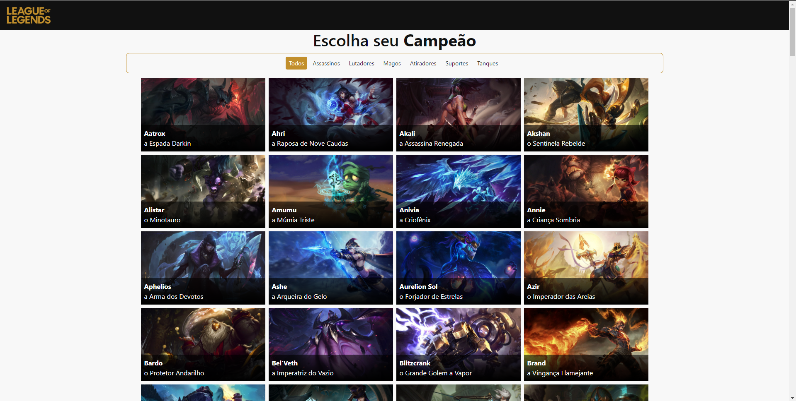
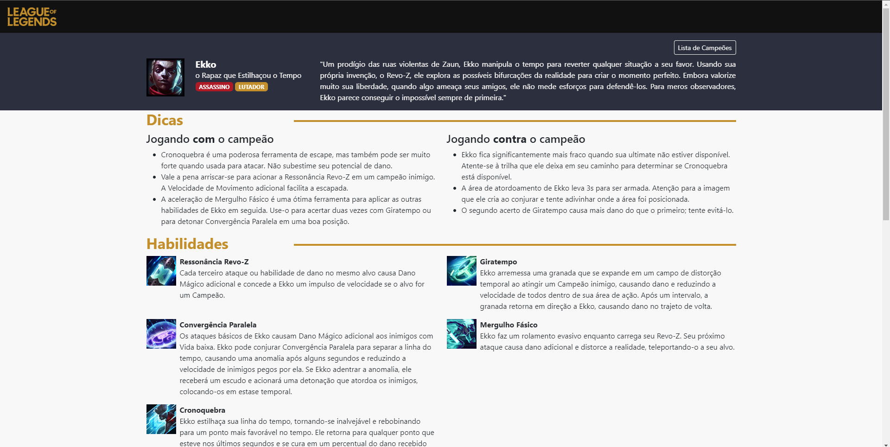

# Listagem de campeões - LOL
[Link para o projeto](https://league-of-legends-champions-gules.vercel.app/)

[API do League of Legends](https://developer.riotgames.com/docs/lol)

Aplicação desenvolvivda para listar todos os campeões do jogo League of Legends (LOL) e disponibilizar informações detalhadas de cada campeão (história, dicas de jogo, habilidades e "skins").

Projeto criado para estudos com React e incremento de portfólio.

## Tecnologias utilizadas:
* React
* Vite
* React Router
* React Bootstrap
* Axios
* TypeScript
* Vercel (deploy)

### Próximos passos:
* Input de filtro por nome;
* Página paa exibição de itnes;
* Alteração do layout dos "cards" dos campeões;
* Refatoração de código para componentização.